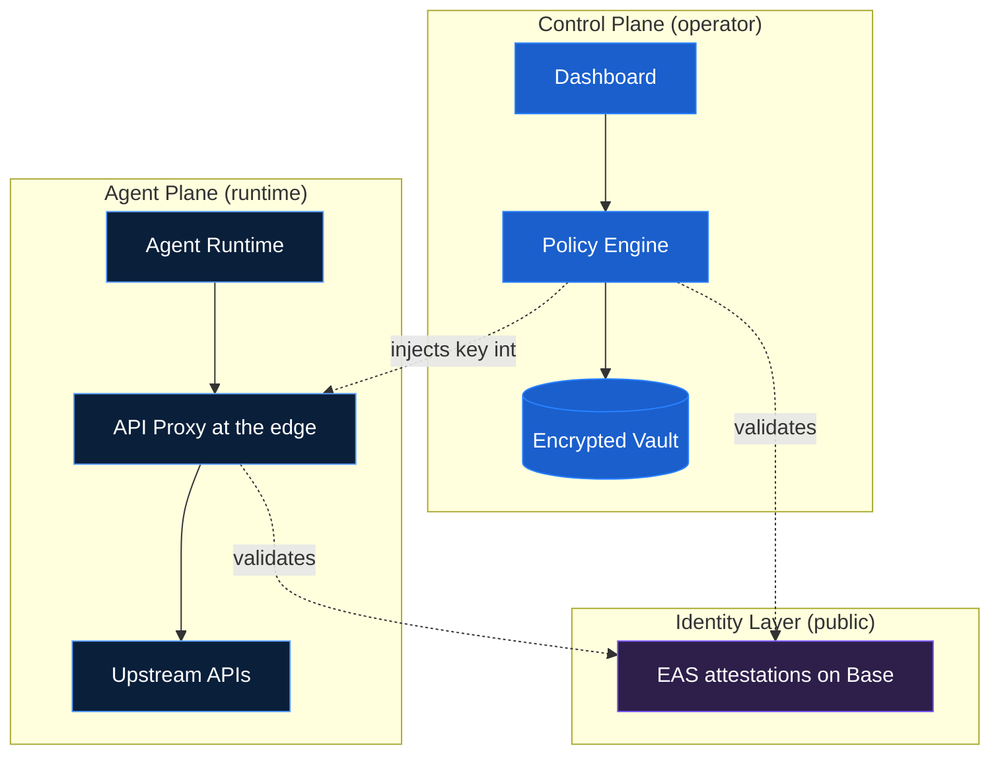
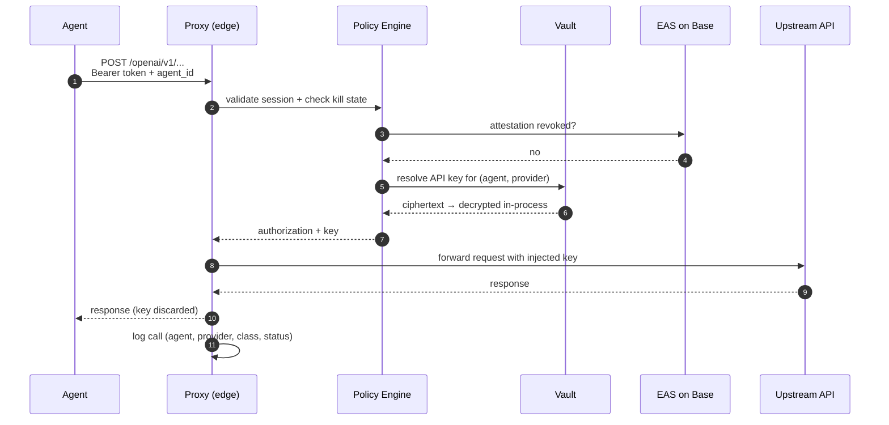

From inside the agent runtime, AgentRoot does not exist. The agent knows three environment variables: an `agent_id`, a `token`, and a `proxy` URL. It sends HTTPS requests to the proxy as it would to any upstream API. The proxy returns responses. That is the entire interface.

Everything else in this page describes infrastructure the agent will never see, touch, or need to understand.

## The two-plane model

AgentRoot separates the operator's control surface from the agent's runtime surface. The two planes share no credentials, no sessions, and no privileges. An attacker who compromises one plane cannot reach the other.



**Control plane** is where you, the operator, work: register agents, add API keys, set thresholds, monitor activity, trigger kills. The dashboard is *untrusted for key custody* — it can submit keys for encrypted storage but never retrieves plaintext. The policy engine is the single point of authorization. The vault holds every secret in the system.

**Agent plane** is where the agent runs. It sees the proxy and nothing else. No vault. No dashboard. No policy engine. No keys.

**Identity layer** lives on Ethereum, not on AgentRoot. Every agent has an [EAS](introduction#why-onchain-matters) attestation on Base that records its public key and operator wallet. Both the policy engine and the proxy validate against this layer on every request, and the operator revokes against this layer when issuing a Tier 3 [Kill](kill-switch).

## How a request flows

Every request your agent makes is validated against kill state and onchain identity *before* the upstream is touched, and the API key only exists in memory for the duration of one call. If any check fails, the upstream never hears from us.

The numbered steps map onto the diagram below.



A single failure in any of the validation steps short-circuits the request. The proxy never reaches the upstream if the session is invalid, the kill switch is active, or the attestation is revoked.

## Key custody

The vault is the only place your API keys exist — they're never written to disk by the dashboard, never logged by the proxy, never present in the agent runtime. Three classes of secret live there, each with different rules.

**Customer API keys** (OpenAI, Anthropic, Stripe, etc.) are encrypted in transit by the secure-iframe key-capture component on a separate origin from the dashboard. The dashboard's same-origin policy makes it architecturally impossible for AgentRoot's frontend code to read the value. The vault stores ciphertext; decryption happens only inside the policy engine, only when resolving an authorized request, and only in process memory that's discarded after the response.

**Agent Root Secret Keys (ARSK)** are P-256 keypairs generated *inside* the vault during agent registration. The private key never leaves the vault — not for backup, not for export, not for migration. The public key is recorded in the agent's EAS attestation, creating a verifiable link between the onchain identity and the vault-custodied private key.

**Session tokens** (`art_live_xxx`) are the agent's runtime credential. 24-hour TTL, automatic rotation handled by the SDK. Scoped to a single agent. Cannot be extended by the agent or used to access other agents. If a token is compromised, the damage is bounded to a 24-hour window — and you can revoke it instantly from the dashboard, or revoke the underlying attestation from your wallet for a permanent kill.

The full custody story — including HSM-backed unseal, two-person review for production access to the vault, and threat-by-threat mitigations — is in the [Security Model](security).

## Identity (EAS on Base)

Your agent's identity lives on a public blockchain, not in our database. That's what gives you a Tier 3 kill switch that works even if AgentRoot's infrastructure is down — and a public, verifiable record of who controls what.

An agent's identity is an EAS attestation on Base. The attestation records:

- The agent's public key (P-256, generated in vault)
- The operator's wallet address (or AgentRoot's managed-attester wallet, in social-login mode)
- A schema-defined set of policy fields (per-tx caps, scope flags, sub-agent permissions)
- A `revocationTime` field that is zero while the agent is live and a block timestamp once revoked

The attestation UID is the agent's `agent_id`. It is permanent and onchain. After a [Kill](lifecycle) and [ReMint](lifecycle), a new attestation is issued under the same `agent_id` lineage; the `uid_lineage` chain links every incarnation.

For why this matters — and why a centralized kill switch can't deliver the same property — see [Why onchain matters](introduction#why-onchain-matters).

## Fail-closed at every layer

The system never degrades to an insecure mode. Each failure mode produces a clean, structured rejection:

| Failure | What the agent sees | Why it's safe |
|---|---|---|
| Vault unreachable | `503 VAULT_UNAVAILABLE` | No cached keys; no fallback auth |
| Session token expired | `401 TOKEN_EXPIRED` | No token refresh on the request path |
| Session token revoked | `401 TOKEN_REVOKED` | Revocation propagates before next request |
| Attestation revoked onchain | `403 ATTESTATION_REVOKED` | Permanent; no override |
| Tier 1 binding off | `403 PROVIDER_DISABLED` | Per-binding flag at edge |
| Tier 2 agent paused | `403 AGENT_KILLED` | Per-agent flag at edge |
| Auto-kill threshold breached | `429 RATE_LIMITED` | Threshold-driven Tier 2 enforcement |
| Upstream API error | `502 UPSTREAM_ERROR` | Forwarded as-is from upstream |

Downtime is always preferred over unauthorized access. The proxy will refuse a legitimate request before it serves an unauthorized one.

## What the agent knows

Worth repeating: this is the entire blast radius if the agent runtime is fully compromised.

```bash
AGENTROOT_AGENT_ID=eas:0x8a1f...c3d7
AGENTROOT_TOKEN=eyJhbGci...           # auto-rotating, 24h
AGENTROOT_PROXY=https://proxy.agentroot.app
```

No API keys. No private keys. No vault credentials. No dashboard access. No knowledge of other agents. No path to escalate privileges. The token is a short-lived proxy access credential that contains no key material.

If the agent's environment is fully exposed, the attacker gets at most 24 hours of proxy access with the agent's existing bindings — and you can shut that down in seconds from the dashboard or permanently from your wallet.

## Related

- **[Introduction](introduction)** — the Pinocchio Problem, the action-class thesis, and why onchain matters
- **[Lifecycle](lifecycle)** — Mint, Disable, Kill, ReMint
- **[Kill Switch](kill-switch)** — the four enforcement mechanisms in detail
- **[Security Model](security)** — trust boundaries, threat mitigations, and incident response
- **[SDK Reference](sdk)** — how the agent uses the three env vars
