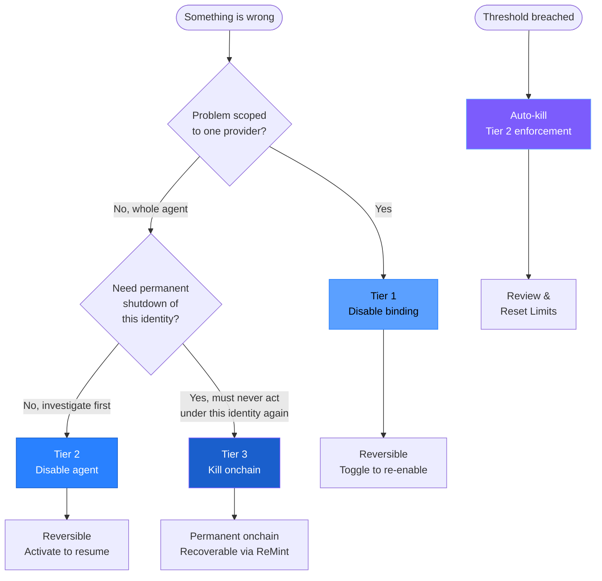

The [lifecycle](lifecycle) is the noun system — Mint, Disable, Kill, ReMint. The kill switch is the verb system — *how* each transition is enforced when you click the button. This page covers the four mechanisms, what they cost, what they cannot do, and what your agent sees when one fires.

If you want scenarios — when to reach for which mechanism — read [Operator Playbooks](playbooks) first.

## The four mechanisms

| Mechanism | Lifecycle | Scope | Speed | Reversible | Requires |
|---|---|---|---|---|---|
| **Tier 1** | Disable (key) | One binding | Instant | Yes | Dashboard |
| **Tier 2** | Disable (agent) | Whole agent | Instant | Yes | Dashboard |
| **Tier 3** | Kill | Onchain | ~30 sec | No (recoverable via ReMint) | Wallet |
| **Auto-kill** | Disable (auto) | Threshold-based | Instant | Yes (reset) | Pre-configured |

Tier 1, Tier 2, and Auto-kill are all forms of Disable — they flip a flag the proxy checks on every request. Tier 3 is the only mechanism that touches onchain state; it is the sovereign kill, and it works without AgentRoot's infrastructure.

## Tier 1 — disable one API binding

**What it does:** flips a per-binding flag in proxy state. The proxy returns `403 PROVIDER_DISABLED` for any call from this agent to this provider. Other providers, same agent, still work.

**Where the flag lives:** Cloudflare KV at the edge. Updates propagate globally in under five seconds.

**Reversibility:** click the toggle again. The flag flips back; the next call succeeds.

**Use it for:** one-provider problems. The Stripe API is flaky and you want to cut the agent off from it without pausing the rest. The agent is making too many OpenAI calls and you want to throttle by removing the binding entirely. You're rotating a key and want to shut off this binding while you swap.

For multi-agent shutoffs (one provider for *every* agent), Disable the *key* instead — see [Lifecycle → Keys](lifecycle).

## Tier 2 — disable the whole agent

**What it does:** flips an agent-level flag. The proxy returns `403 AGENT_KILLED` for *every* call from this agent — it doesn't even resolve which provider was being called. Cheaper to enforce, faster to fail.

**Where the flag lives:** same Cloudflare KV layer, separate key. Same global propagation window.

**Reversibility:** click Activate. Instant.

**Use it for:** agent-shaped problems. The agent is misbehaving in ways you don't yet understand. You're deploying a new version and want zero traffic during the transition. The 3am scenario in [Playbooks](playbooks) — pause first, investigate second.

This is the most-used kill in practice. It's the "cut the strings" tug — you stop everything, decide what to do, then either resume or escalate to Tier 3.

## Tier 3 — revoke onchain (sovereign)

**What it does:** sets the EAS attestation's `revocationTime` to the current block timestamp on Base. The proxy checks attestation status on every request (via a cached subgraph view, refreshed continuously) and returns `403 ATTESTATION_REVOKED` for any agent whose attestation is revoked.

**The critical property:** the revocation transaction is between *your wallet* and *the EAS contract on Base*. AgentRoot is not in the loop. You don't need our dashboard, our API, our subgraph, or our servers. If you have your wallet and a way to talk to Ethereum, you can kill the agent — even if AgentRoot has gone dark.

**Sovereign mode (SIWE):** your wallet signs the revocation directly. AgentRoot's attester is uninvolved.

**Managed mode (social login):** AgentRoot's attester signs the revocation on your behalf via the dashboard. This is convenient but not sovereign — if AgentRoot is offline, the kill cannot be issued. To upgrade to sovereign Tier 3, sign up with SIWE; the social-to-SIWE migration path is in development.

**Cost:** Base gas (typically under one cent) in sovereign mode; included in managed mode.

**Reversibility:** none. The revocation is permanent and onchain. But the agent is **recoverable** — see ReMint in [Lifecycle](lifecycle). Vault keys, API bindings, and audit history all carry forward to a new attestation under the same `agent_id` lineage.

**Use it for:** "this agent must not act under this identity again." Compromised credentials. Failed deployment that signed something it shouldn't have. End-of-life. Compliance teardown. Or any moment where you want a permanent, publicly verifiable record that the agent was stopped.

## Auto-kill — threshold-based

**What it does:** the proxy maintains per-agent and per-key counters in Cloudflare D1. When a counter exceeds a configured threshold, the proxy automatically sets the Tier 2 flag on the offending agent (or the equivalent key-level flag) and returns `429 RATE_LIMITED` on subsequent calls.

**Where to configure:** Dashboard → Agent → Auto-Kill Thresholds. Per-class quotas (Spend, Communication, Writes, Transactions, Provisioning, Destruction) are also set here — see [Action Classes](action-classes) for what each governs.

**Common thresholds operators set:**
- Spend per day / per month
- Request rate (requests per minute)
- Error rate (% of failed calls in a rolling window)
- Action-class quotas (e.g. "no more than 5 Destruction calls per hour")
- Per-recipient Communication caps (e.g. "no more than 10 emails to the same address per day")

**Reversibility:** review what tripped the threshold, raise the threshold if appropriate, click **Reset Limits**. The agent resumes.

**Use it for:** every agent. Auto-kill is the safety net you should never deploy without. The cost of setting a threshold and never breaching it is zero. The cost of *not* setting one and discovering at 9am Monday that the agent ran for 60 hours is unbounded.

## What the agent sees

Each kill mechanism returns a structured error. The HTTP status is the first signal; the JSON body identifies the tier and the specific code.

| HTTP | Code | Tier | Meaning |
|---|---|---|---|
| 403 | `PROVIDER_DISABLED` | 1 | This binding is off; other providers may still work |
| 403 | `AGENT_KILLED` | 2 | The whole agent is paused; nothing will work until Activate |
| 403 | `ATTESTATION_REVOKED` | 3 | The agent's onchain identity is revoked permanently |
| 429 | `RATE_LIMITED` | auto | A threshold was breached; review and Reset Limits |

```json
{
  "error": {
    "code": "AGENT_KILLED",
    "message": "Agent has been paused by operator",
    "tier": 2
  }
}
```

The SDK maps these to typed errors:

```typescript
import { AgentRootError } from '@agentroot/sdk';

try {
  await ar.proxy({ ... });
} catch (e) {
  if (e instanceof AgentRootError) {
    switch (e.code) {
      case 'AGENT_KILLED':
      case 'ATTESTATION_REVOKED':
        await gracefulShutdown();
        break;
      case 'PROVIDER_DISABLED':
        await tryAlternateProvider();
        break;
      case 'RATE_LIMITED':
        await backoffAndRetry(e.retryAfter);
        break;
    }
  }
}
```

See [SDK Reference](sdk) for the full error catalog.

## Verifying a kill fired

After triggering any kill, verify it from outside the dashboard.

**For Tier 1, 2, and Auto-kill:** make a call through the proxy. Expect a 403 (or 429) with the appropriate error code:

```bash
curl -s -o /dev/null -w "%{http_code}\n" \
  -X POST https://proxy.agentroot.app/openai/v1/chat/completions \
  -H "Authorization: Bearer $AGENTROOT_TOKEN" \
  -H "X-AgentRoot-ID: $AGENTROOT_AGENT_ID" \
  -H "X-AgentRoot-Provider: openai" \
  -H "Content-Type: application/json" \
  -d '{"model":"gpt-4o","messages":[{"role":"user","content":"ping"}]}'
```

**For Tier 3:** verify directly onchain. Any Base block explorer or EAS interface will show the attestation's `revocationTime` is non-zero. This verification works even if AgentRoot is offline — the source of truth is the chain.

## Decision tree

Which mechanism to reach for, in flowchart form:



The default move is **Tier 2** — pause first, investigate second. Tier 1 is for known-good single-provider problems. Tier 3 is for the rare cases where you need a permanent, publicly verifiable record that the agent's identity was retired. Auto-kill should be configured on every agent as a backstop regardless of which manual tier you favor.

For the operator-facing version of this — when to use each in real scenarios — see [Operator Playbooks](playbooks).

## What kills do *not* do

Important boundaries on what a kill can — and cannot — affect.

**Kills do not unsign in-flight authorizations.** AgentRoot can't unsign what's already signed; AgentRoot stops the *next* signature. An EIP-3009 payment authorization signed milliseconds before the owner's revoke can still be settled by the facilitator — no protocol can prevent that, and that's why x402 is decisive at settlement time. The blast radius is bounded by EOA balance and the per-tx cap encoded in the agent's attestation; the kill primitive eliminates all *future* signing authority instantly. For graceful exits where you don't want any in-flight authorization to settle against an empty EOA, use **kill-with-sweep** from the dashboard — the sweep transaction runs while the attestation is still live, then the revocation transaction follows.

**Kills do not delete the agent's vault state.** Vault keypair, API keys, bindings, and audit history all survive a Tier 3 Kill. That's what makes ReMint possible — same memory, fresh attestation. To purge state, hard-delete the agent from the dashboard *after* the Kill.

**Kills do not affect other agents.** Each agent has its own EAS attestation, its own vault keypair, its own session token, its own bindings. Killing one agent has no operational effect on any other agent. The kill is scoped.

**Kills do not break the `agent_id` lineage.** A Killed agent's `agent_id` UID is the EAS attestation UID, which is permanent. After ReMint, the new attestation has a new UID, but the `agent_id` lineage chain links them — anyone querying the chain can follow the chain of custody from incarnation to incarnation.

## Related

- **[Lifecycle](lifecycle)** — Mint, Disable, Kill, ReMint as first-class concepts
- **[Operator Playbooks](playbooks)** — when to reach for which kill, in real scenarios
- **[Action Classes](action-classes)** — per-class auto-kill thresholds
- **[Architecture](architecture)** — how kill state propagates through the proxy
- **[SDK Reference](sdk)** — handling kill-switch errors in agent code
